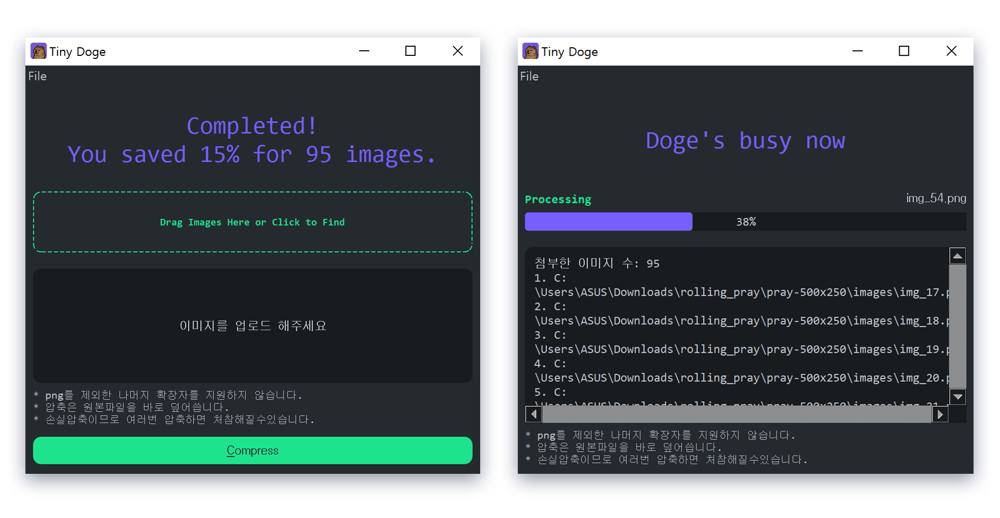
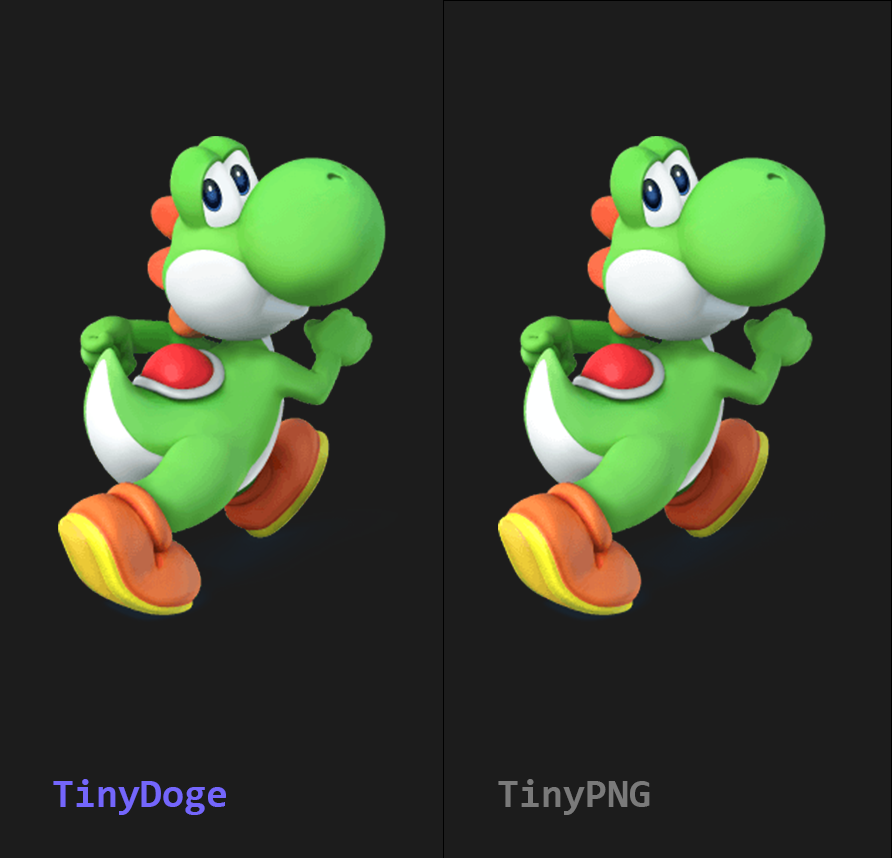

# Tiny Doge

[pngquant](https://pngquant.org/)를 이용한 GUI Lossy PNG Compressor.
- TinyPNG 게섯거라! 무료, 빠르면서도 TinyPNG와 비슷한 결과를 산출하는 것을 목적으로 만들어졌습니다.

# Performance

| 파일명          | 사이즈     | TinyDoge      | TinyPNG        |
|--------------|---------|---------------|----------------|
| dice.png     | 83.9kb  | 19.3kb (-76%) | 20.1kb (-76%)  |
| justice.png  | 196.2kb | 49.2kb (-74%) | 46.6kb (-76%)  |
| mountain.png | 50.7kb  | 49.5kb (-5%)  | 48.3kb (-5%)   |
| mushroom.png | 43.4kb  | 10.5kb (-75%) | 18.0kb (-60%)  |
| pixel.png    | 992b    | 992b (0%)     | 947b (-5%)     |
| yoshi.png    | 93.4kb  | 20.6kb (-77%) | 20.1 kb (-79%) |
- `test_images/`내의 파일들을 테스트한 결과입니다.
- 결과 파일들은 `test_images_tinydoge/`, `test_images_tinypng/` 폴더에서 확인하실 수 있습니다.

# 설치방법
### Windows
- `TinyDoge_Win_Portable.zip` 압축을 해제합니다.
- `TinyDoge.exe` 바탕화면 바로가기를 만듭니다.

### OSX
- 맥북이 없어 빌린다음에 작성하겠음...